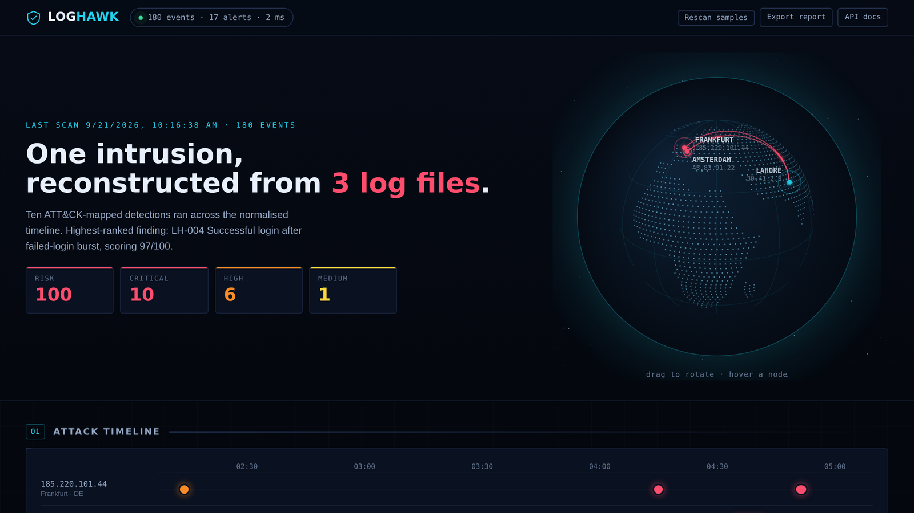

# LogHawk

[](https://github.com/Cyb3r-Abdullah/loghawk/actions/workflows/ci.yml)
[](https://www.python.org/downloads/)
[](LICENSE)

**A blue-team log analysis and detection engine.** Point it at auth logs, web
access logs and Windows Security events; it normalizes them into one event
schema, runs ten MITRE ATT&CK-mapped detection rules over them, scores what it
finds, and hands you a triage queue — from the terminal or from a SOC
dashboard.

```
$ loghawk scan /var/log --verbose

  SCAN SUMMARY
  ------------------------------------------------------------------
  Events parsed   : 180
  Alerts raised   : 17
  Scan duration   : 3 ms
  Risk score      : 100/100 [########################################] CRITICAL
  Severity        : critical=10  high=6  medium=1  low=0

   1.  CRITICAL  Successful login after failed-login burst [LH-004] score 97/100
      Account 'deploy' authenticated from 45.83.91.22 after 40 failed
      attempts in the preceding 5 minutes.
      src=45.83.91.22 | user=deploy | host=web-01 | events=41
      ATT&CK  T1110 Brute Force, T1078 Valid Accounts
```



The detection engine, parsers, storage, scoring and reporting are **pure Python
standard library**. FastAPI and uvicorn are needed only if you want the web
dashboard.

---

## Why this project

Every SOC analyst does the same loop: collect logs, normalize them, apply
detection logic, rank what comes out, and decide what is real. LogHawk is that
loop, built small enough to read end to end and honest enough to show where the
hard parts are — correlating a success with the failures that preceded it,
keeping a noisy scanner from outranking a real compromise, and *not* alerting
when a colleague simply mistypes their password twice.

## What it detects

| Rule | Detection | ATT&CK |
|---|---|---|
| LH-001 | SSH brute force | T1110.001 |
| LH-002 | Password spraying | T1110.003 |
| LH-003 | Account enumeration | T1087 |
| LH-004 | **Successful login after a failed-login burst** | T1110 + T1078 |
| LH-005 | Impossible travel | T1078 |
| LH-006 | Off-hours privileged logon | T1078.003 |
| LH-007 | Suspicious sudo activity | T1548.003, T1003.008 |
| LH-008 | Account created / added to a privileged group | T1136.001, T1098 |
| LH-009 | Web exploitation (SQLi, traversal, XSS, Log4Shell, command injection) | T1190 |
| LH-010 | Automated web scanning | T1595.002 |

Full catalog with scoring details and analyst playbooks: **[docs/DETECTIONS.md](docs/DETECTIONS.md)**.

## Supported log sources

| Source | Format | Notes |
|---|---|---|
| Linux `auth.log` / `secure` | syslog | sshd, sudo and PAM; handles the missing-year problem |
| nginx / Apache | combined access log | URL-decodes before signature matching; normalizes timezone offsets to UTC |
| Windows Security | JSON export | Event IDs 4624/4625/4634/4648/4672/4720/4728/4732/4740 |

Formats are auto-detected by sniffing the first 40 lines, so you can hand it a
directory of mixed logs and it sorts them out.

---

## Quick start

### Windows — just double-click

Two launchers are included. They find your Python, create a virtual
environment on first run, install what's needed, and start up:

| File | What it does |
|---|---|
| `run-dashboard.bat` | Sets everything up, seeds the database, starts the server and opens the dashboard in your browser |
| `loghawk.bat` | The CLI. Double-click for a menu, or pass arguments straight through: `loghawk.bat scan C:\logs --min-severity high` |

Both print a clear fix-it message if Python is missing rather than failing
cryptically, and both work from a path containing spaces.

### macOS / Linux / any terminal

```bash
git clone https://github.com/Cyb3r-Abdullah/loghawk.git
cd loghawk

# Run the built-in demo: generates a sample intrusion and analyzes it.
python -m loghawk demo --verbose
```

That regenerates three sample logs telling one story — recon, exploitation,
account enumeration, brute force, a successful guess, privilege escalation, and
domain persistence — and prints the reconstructed attack chain.

### Scan your own logs

```bash
python -m loghawk scan /var/log/auth.log
python -m loghawk scan ./logs --min-severity high --verbose
python -m loghawk scan ./logs --format markdown -o incident-report.md
python -m loghawk scan ./logs --format json | jq '.alerts[] | select(.score > 80)'
python -m loghawk scan ./logs --rule LH-004        # one rule only
python -m loghawk scan ./logs --disable LH-010     # mute the noisy one
```

`--year` matters for syslog, which omits the year. It defaults to the current
year; pass `--year 2025` when analyzing an older file.

### Use it as a CI gate

```bash
python -m loghawk scan ./logs --fail-on high
```

Exits `1` if anything at or above that severity fired, `0` otherwise — so a
pipeline can fail on suspicious activity in a staging environment's logs. The
bundled GitHub Actions workflow does exactly this.

### Run the dashboard

```bash
pip install -r requirements.txt
python -m loghawk scan ./logs --db loghawk.db
python -m loghawk serve
```

- `http://127.0.0.1:8000/` — SOC dashboard
- `http://127.0.0.1:8000/docs` — interactive OpenAPI docs

The dashboard shows risk tiles, alerts-per-rule and top source addresses, then
an expandable alert queue with evidence lines, ATT&CK links, enrichment context
and one-click triage (`new → triaging → escalated / resolved / false positive`).
Triage state lives in SQLite and **survives a rescan**, so re-running the
scanner never wipes an analyst's work.

---

## Installation

Nothing is required to scan logs:

```bash
git clone https://github.com/Cyb3r-Abdullah/loghawk.git && cd loghawk
python -m loghawk demo
```

For the API/dashboard and for an installed `loghawk` command:

```bash
pip install -r requirements.txt
pip install -e .
loghawk demo
```

Python 3.10+. Tested on 3.10, 3.11 and 3.12.

---

## API

| Method | Endpoint | Purpose |
|---|---|---|
| `GET` | `/api/health` | Service status and rules loaded |
| `GET` | `/api/rules` | Detection catalog with ATT&CK mappings |
| `POST` | `/api/scan` | Scan server-side paths |
| `POST` | `/api/scan/upload` | Upload log files and scan them |
| `GET` | `/api/alerts` | Filter by severity, rule, source IP, triage status |
| `GET` | `/api/alerts/{id}` | Single alert with full evidence and context |
| `PATCH` | `/api/alerts/{id}` | Update triage status and analyst notes |
| `GET` | `/api/stats` | Counts by severity, status and rule; top offenders |
| `GET` | `/api/export/{csv,markdown}` | Export the alert queue or an incident report |

```bash
curl -s localhost:8000/api/alerts?min_severity=critical | jq '.alerts[].title'
curl -s -X PATCH localhost:8000/api/alerts/<id> \
  -H 'Content-Type: application/json' \
  -d '{"status":"escalated","notes":"confirmed via session logs"}'
curl -s localhost:8000/api/export/markdown -o incident.md
```

---

## How it works

```
  log files                parsers              engine                outputs
 ───────────           ──────────────      ────────────────      ────────────────
  auth.log      ──┐    LinuxAuthParser  ┐
  access.log    ──┼──▶ NginxParser      ├──▶  Event[]  ──▶  10 detections
  security.json ──┘    WindowsParser    ┘        │               │
                                                 │               ▼
                       format auto-detected      │          Alert[] scored,
                       by sniffing 40 lines      │          deduped, ranked
                                                 │               │
                                    enrichment ──┘               ├──▶ console / JSON / CSV / Markdown
                                    (geo, threat feed,           ├──▶ SQLite  (triage state)
                                     private-range)              └──▶ FastAPI ──▶ dashboard
```

**One normalized `Event`.** Every parser emits the same dataclass, so a
detection written once works across all three log sources. Adding a fourth
source means writing one parser — no rule changes.

**Rules are independent and isolated.** Each returns alerts from a time-sorted
event list and is side-effect free. A rule that throws is caught, recorded in
`result.errors`, and the scan continues — one bad regex cannot blind the whole
engine.

**Scoring is layered, not flat.** A rule starts at `base_score`, adds context
(threat-feed hit, privileged account, payload that reached application logic,
attack volume), then clamps to its own ceiling. The ceilings encode analyst
judgment: brute force caps at 90 and web scanning at 80, so a loud *attempt*
never outranks LH-004's *confirmed* compromise at 97. The overall risk score is
driven by the worst finding, never an average — ten low alerts must not
outweigh one real one.

**Bursts collapse into one alert.** A sliding window merges overlapping
detections, so 60 password guesses produce a single alert with 60 events
attached, not 60 alerts.

**Fingerprints make rescans idempotent.** Each alert hashes to a stable id from
its rule, entities and start time. Re-scanning updates the row instead of
duplicating it, which is what lets triage status persist.

### Project layout

```
loghawk/
├── models.py              Event, Alert, Severity, MitreTechnique
├── enrich.py              geolocation, threat feed, private-range checks
├── engine.py              orchestration, dedup, ranking, risk score
├── store.py               SQLite persistence + triage state
├── report.py              console / JSON / CSV / Markdown renderers
├── cli.py                 argparse CLI
├── api.py                 FastAPI routes
├── dashboard.html         single-file SOC dashboard
├── parsers/               one module per log source + auto-detection
└── detections/            one module per rule family
docs/DETECTIONS.md         generated from the rule classes themselves
samples/                   the demo intrusion + its generator
tests/                     105 tests
```

---

## Testing

```bash
python run_tests.py -v      # stdlib runner, no pytest needed
python -m pytest tests -q   # also works
```

105 tests. Every detection has **two** kinds of test: it fires on the attack it
was written for, and it stays quiet on benign activity that resembles it —

- three failed logins from the office IP (someone mistyping) → no alert
- twelve failures spread over six hours → no alert (too slow for the window)
- the same account hammered → brute force fires, spray does *not*
- a login from Amsterdam and one from Lahore twelve hours apart → no alert
- one genuine 404 for `/favicon.ico` → no alert

False-positive control is most of what makes a detection engine usable, so it
is most of what the suite tests.

---

## Extending it

Adding a detection is three steps:

```python
# loghawk/detections/my_rule.py
from ..models import MitreTechnique, Severity
from .base import BaseDetection

class DataExfiltration(BaseDetection):
    rule_id = "LH-011"
    title = "Large outbound transfer"
    description = "An unusual volume of data left the host in one session."
    severity = Severity.HIGH
    base_score = 70
    max_score = 90
    mitre = (MitreTechnique("T1048", "Exfiltration Over Alternative Protocol",
                            "Exfiltration"),)
    recommendation = "Correlate with the destination's reputation..."

    def run(self, events):
        for event in events:
            if event.extra.get("size", 0) > 50_000_000:
                yield self.make_alert([event], description="...", src_ip=event.src_ip)
```

Import it in `detections/__init__.py`, append it to `ALL_DETECTIONS`, and
regenerate the docs with `python docs/generate_catalog.py > docs/DETECTIONS.md`.
The CLI, API, dashboard, scoring and storage pick it up with no other changes.

Adding a log source is the same shape: subclass `BaseParser`, implement
`sniff()` and `parse_line()`, register it in `parsers/__init__.py`.

---

## Notes and limitations

Worth being straight about, since a portfolio project should be:

- **Geolocation is a bundled demo table**, not a real GeoIP database. It keeps
  the project offline and key-free. `enrich.geolocate()` is the single swap
  point for MaxMind GeoLite2 or an API.
- **The threat feed is three static CIDRs**, standing in for a real intel feed.
- **Detections are stateless per scan.** There is no baseline of "normal" for a
  given user or host, so impossible travel cannot learn that someone commutes
  between two countries. A production version would keep per-entity baselines.
- **Windows events are read from a JSON export**, not from EVTX directly.
- The sample logs are synthetic, generated by `samples/generate_samples.py`.

## License

MIT — see [LICENSE](LICENSE).
